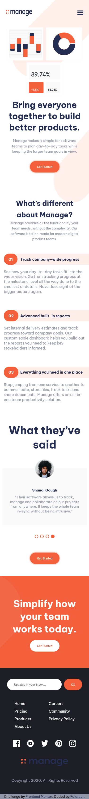
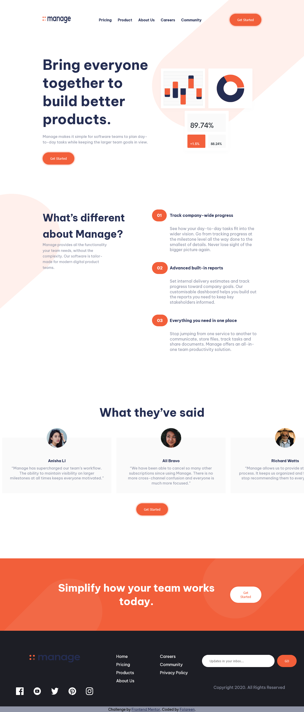

# Frontend Mentor - Manage landing page solution

This is a solution to the [Manage landing page challenge on Frontend Mentor](https://www.frontendmentor.io/challenges/manage-landing-page-SLXqC6P5). Frontend Mentor challenges help you improve your coding skills by building realistic projects. 

## Table of contents

- [Overview](#overview)
  - [The challenge](#the-challenge)
  - [Screenshot](#screenshot)
  - [Links](#links)
- [My process](#my-process)
  - [Built with](#built-with)
  - [What I learned](#what-i-learned)
  - [Continued development](#continued-development)
- [Author](#author)

## Overview

### The challenge

Users should be able to:

- View the optimal layout for the site depending on their device's screen size
- See hover states for all interactive elements on the page
- See all testimonials in a horizontal slider
- Receive an error message when the newsletter sign up `form` is submitted if:
  - The `input` field is empty
  - The email address is not formatted correctly

### Screenshot

**Mobile screeenshot**

**Desktop screenshot**

### Links

- Solution URL: [Add solution URL here]( https://manage-landing-page-frontend.netlify.app/)
- Live Site URL: [https://manage-landing-page-frontend.netlify.app](https://manage-landing-page-frontend.netlify.app)

## My process

### Built with

- Semantic HTML5 markup
- Flexbox
- CSS Grid
- Mobile-first workflow
- SCSS

### What I learned

- SCSS/SASS

### Continued development

Grabbing event listener for sliding testimonies

## Author

- Frontend Mentor - [@Folareen](https://www.frontendmentor.io/profile/Folareen)
- Twitter - [@Folareen](https://www.twitter.com/__folareen__)